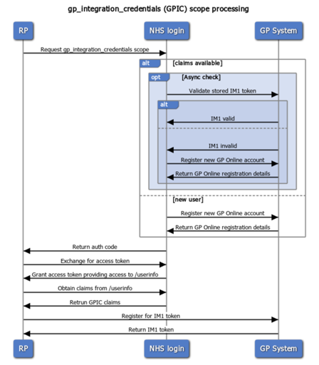

## Introduction

NHS login supports a scope of gp_integration_credentials which will allow a Relying Party (RP) to retrieve the following user claims:

- Account ID
- ODS Code
- Linkage Key

These three pieces of information are required by IM1 paired services to create an IM1 token which is then used by the RP to invoke the GP system patient facing APIs. 

Retrieving these items of information via NHS login removes the need for the user to enter them manually, as well as being able to seamlessly register previously unregistered GP Online users – preventing a visit to a GP Practice.

## This diagram illustrates:
1. How NHS login processes a request from an RP for gp_integration_credentials via the /userinfo endpoint
2. How NHS login validates gp_integration_credentials on each request and how gp_integration_credentials are refreshed if the information held by NHS login is invalid

## GP integration credentials validation

When **gp_integration_credentials** scope is requested by an RP, NHS login performs a background check of the validity of a stored IM1 token. 

As this check runs in the background asynchronously, it is the responsibility of the RP to also validate their IM1 token (if one exists).

If the RP determines that the claims returned from gp_integration_credentials scope are not valid it can request refreshed claims from NHS login by re-starting the login process.

Optional - the RP can utilise the “asserted_login_identity” request parameter to avoid the user needing to re-authenticate.

## GP integration credentials are no longer valid

The reasons that the GP credentials might no longer be valid are:

1. The user has moved GP Practice.
2. The GP Practice has changed GP systems.
3. GP Practices merge / divides.
4. The user’s GP online access been revoked at the GP system. This could be for multiple failed login attempts for example.

In cases 1, 2 and 3 generally the ODS code for the user changes and will be detected by NHS login automatically via a separate background process that validates PDS information relating to the user.

## Assumptions: 
- When GP credentials (linkage keys) expire or get invalidated all the IM1 tokens generated using them also expire/get invalidated.

- RP should cater for user journey which prevents the user getting into an endless “retrieve GP credential” loop if the credentials genuinely can’t be retrieved.

## GP systems coverage

Currently NHS login provides coverage for GP login credentials as per below:

- EMIS :  100%
- TPP  : 100%
- Vision : 3 Practices (250 in total – rollout in progress)
- Microtest **: None (36 in total)

** GP login credentials (linkage keys) for Microtest returned by NHS login are dummy in nature (to maintain the uniform behaviour of the service). These GP login credentials cannot be used by RPS for connecting to Microtest. 

***
## Want to edit this page?
1. Click this [link](https://github.com/faithmawi/nhs-dev-docs/blob/master/src/gp-credentials-doc.md) 
2. Then click the edit button in the top right of the document
3. Make sure you click **Commit changes** when you're done